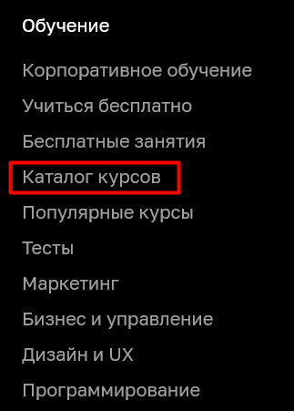
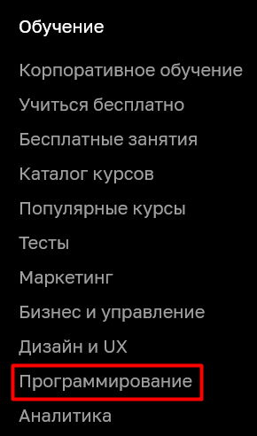

## 1. Перечень автоматизируемых сценариев
### Сценарии навигации

_**Сценарий №1**_

1. На главной странице [Нетологии](README.md:6) нажать на кнопку "Каталог курсов"

2. В открывшемся списке выбрать направление "Программирование"

3. На странице раздела [Программирование](https://netology.ru/development) выбрать профессию "Тестировщик ПО"

4. На странице курса кликнуть по кнопке "Записаться"

_**Сценарий №2**_

1. Главную страницу [Нетологии](README.md:6)и пролистать до раздела "Направления обучения" и выбрать "Программирование"

2. Повторить шаги 3 и 4 из **сценария №1**

_**Сценарий №3**_

1. Главную страницу [Нетологии](README.md:6) пролистать до футера страницы и в колонке "Обучение" кликнуть на "Каталог курсов"

2. Повторить шаги 2, 3 и 4 из **сценария №1**

_**Сценарий №4**_

1. Повторить 1 шаг из **сценария №3**
2. В разделе "Все курсы" в поисковой строке ввести "Тестировщик ПО"

3. В ниспадающем списке кликнуть по профессии "Тестировщик ПО"
4. На странице курса кликнуть по кнопке "Записаться"

_**Сценарий №5**_

1. Главную страницу [Нетологии](README.md:6) пролистать до футера страницы, в колонке "Обучение" кликнуть на курс "Программирование"

2. Повторить шаги 3 и 4 из **сценария №1**

### Тестовые сценарии:

### *Позитивные сценарии:*
* **Ввод валидных данных**

1. Ввести в поле "Имя" "Наталья"
1. Ввести номер телефона "+79111702961"
1. Нажать на кнопку "Записаться"

*Ожидаемый результат:* Появляется окно с текстом "Поздравляем! Вы успешно записаны на курс "Тестировщик ПО". Наш специалист свяжется с Вами в ближайшее время для дальнейших инструкций.".

* **Ввод имени, состоящего из 2 букв**

1. Ввести в поле "Имя" "Ли"
1. Ввести номер телефона "+79111702961"
1. Нажать на кнопку "Записаться"

*Ожидаемый результат:* Появляется окно с текстом "Поздравляем! Вы успешно записаны на курс "Тестировщик ПО". Наш специалист свяжется с Вами в ближайшее время для дальнейших инструкций.".

### *Негативные сценарии:*
* **Ввод имени, состоящего из 1 буквы**

1. Ввести в поле "Имя" "Н"
1. Ввести номер телефона "+79111702961"
1. Нажать на кнопку "Записаться"

*Ожидаемый результат:* Поле Имя подсвечено красным, появилось сообщение "Должно быть не короче 2 символов".

* **Ввод символов в поле Имя**

1. Ввести в поле "Имя" "№%:"
1. Ввести номер телефона "+79111702961"
1. Нажать на кнопку "Записаться"

*Ожидаемый результат:* Поле Имя подсвечено красным, появилось сообщение "Должно состоять из букв"

* **Ввод невалидного телефона**

1. Ввести в поле Имя "Наталья"
1. Ввести номер телефона "+70000000"
1. Нажать на кнопку "Записаться"

*Ожидаемый результат:* Поле Имя подсвечено красным, появилось сообщение "Номер в формате +9(999)999-99-99"

## 2. Перечень используемых инструментов с обоснованием выбора
1. Gradle - используем в качестве основной системы сборки, так как в нем удобно подключать плагины, также в качестве репорт-системы, так как такая отчетность экономит время, и нам не нужны более подробные отчёты
1. Junit Jupiter - API для тестов
1. Selenide - используем в тестах для взаимодействия с SUT
1. СУБД, подходящая для сайта
1. IDEA - редактор для работы над проектом
1. Lombok - для сокращения кода в классах

## 3.Перечень необходимых разрешений, данных и доступов
Для автоматизации нам потребуется:
1. Разрешение на тестирование от правообладателя сайта [Нетология](README.md:6)
1. Препрод-среда, если она преусмотрена в компании
1. Доступы к базе данных и API сайта [Нетологии](README.md:6)

## 4. Перечень и описание рисков при автоматизации
1. Автоматизация может оказаться трудозатратнее ручного тестирования
1. Невозможность автоматизировать ошибки дизайна
1. Невозможность провести нагрузочное тестирование
1. Трудности при поиске локаторов элементов на страницах, в ходе выполнения проекта может измениться структура сайта и локаторы придётся уточнять

## 5. Перечень необходимых специалистов для автоматизации
* Автотестировщик

## 6. Интервальная оценка с учётом рисков в часах:
15-20 часов.